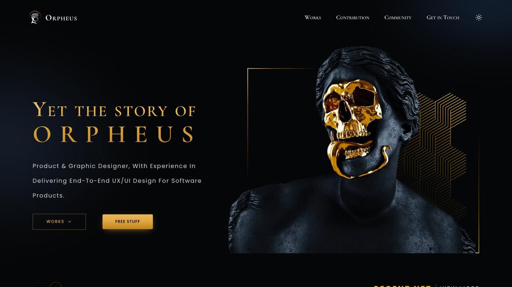
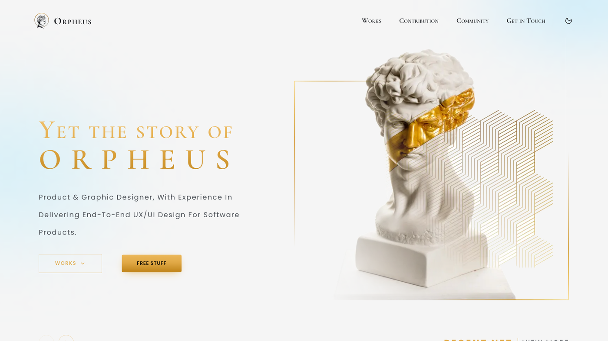
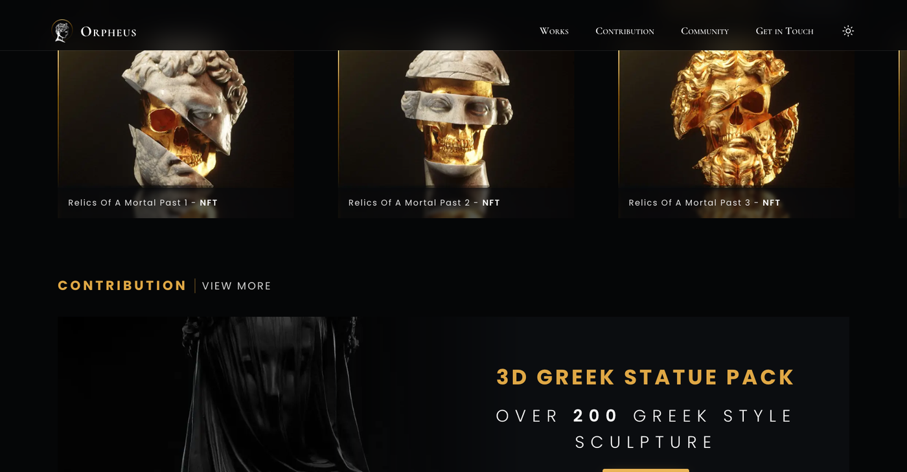

<div align="center">

# Orpheus

**A designer portfolio, rebuilt one-to-one from its Figma source.**

Dark and light themes, measured off the 1728px artboard down to the letter-spacing.

**[View the live site →](https://orpheus-dusky.vercel.app)**

<br />



<br />

[](https://nextjs.org)
[](https://react.dev)
[](https://typescriptlang.org)
[](https://tailwindcss.com)
[](https://motion.dev)
[](https://orpheus-dusky.vercel.app)

</div>

---

## About

Every measurement here comes from the design, not from eye-balling it. Type
sizes, letter-spacing, section rhythm and the ambient glow colours were sampled
from the Figma renders and checked back against them pixel by pixel — the built
page lands within a couple of pixels of the artboard in both themes, and the
hero artwork sits on its exact Figma coordinates.

## Preview

<table>
<tr>
<td width="50%"></td>
<td width="50%"></td>
</tr>
<tr>
<td align="center"><sub><b>Dark</b></sub></td>
<td align="center"><sub><b>Light</b></sub></td>
</tr>
</table>



## Highlights

- **Two complete themes** — every colour resolves through a CSS variable, so
  dark and light share one stylesheet and switch with no flash.
- **Drag-to-scroll works carousel** that bleeds past the right gutter, with
  keyboard-reachable controls.
- **Off-canvas mobile navigation** — slides in from the right, locks page
  scroll, closes on Escape or a backdrop tap.
- **Artwork placed by coordinate**, not by feel: both hero plates are single
  images with intrinsic dimensions, positioned by their Figma rect.
- **Motion that respects the reader** — `prefers-reduced-motion` is honoured
  through `MotionConfig`, so the markup stays identical on server and client.

## Stack

| | |
| --- | --- |
| Framework | Next.js 16 (App Router, Turbopack) + React 19 |
| Language | TypeScript |
| Styling | Tailwind CSS v4 — CSS-first `@theme`, no config file |
| Animation | Motion (`motion/react`) |
| Carousel | Embla Carousel |
| Theming | `next-themes`, class strategy |
| Icons | `lucide-react` (UI) + `react-icons` (brands) |
| Fonts | Cormorant Garamond + Poppins via `next/font` |

## Getting started

```bash
npm install
```

```bash
npm run dev
```

Then open <http://localhost:3000>.

```bash
npm run build
```

## Project layout

```
src/
  app/
    globals.css        design tokens, theme variables, shared utilities
    layout.tsx         fonts, metadata, providers
    page.tsx           section composition
  components/
    decor/             ambient background glows
    layout/            navbar, logo, theme toggle, mobile drawer
    sections/          hero, works, contribution, connect
    ui/                buttons, section title, work card, banner, reveal
  lib/
    content.ts         all copy and asset references
images/                raw Figma exports
public/images/         processed assets — see its README
docs/                  preview screenshots
```

## Design tokens

`src/app/globals.css` holds the whole system. `:root` carries the light theme
and `.dark` overrides it:

- `--gold-100 … --gold-600` — the metallic ramp sampled from the Figma
  gradients, used by `text-gold-gradient` and `bg-gold-gradient`
- `--bg`, `--fg`, `--fg-muted`, `--panel`, `--panel-alt`, `--hairline`
- `--glow-left`, `--glow-right` — the ambient ellipses behind the header
- `--gutter`, `--gutter-nav`, `--page-max` — the artboard's own spacing

## Editing content

Copy, navigation, work cards, banners and social links all live in
`src/lib/content.ts`. Images live in `public/images` — see the
[asset notes](public/images/README.md) for export sizes and hero placement.

## Deployment

Hosted on Vercel and linked to this repository — every push to `main` ships a
new production build automatically.

## Accessibility

Semantic landmarks throughout, visible focus rings on the gold accent, an
Escape-and-backdrop-dismissable mobile drawer with scroll lock, and every
entrance animation disabled under `prefers-reduced-motion`.

---

<div align="center">

Designed &amp; built by **[Mahmud Ulashev](https://ulashev.uz)**

[Portfolio](https://ulashev.uz) · [Telegram](https://t.me/mahmud_ulashev) · [GitHub](https://github.com/mahmudulashev)

</div>
